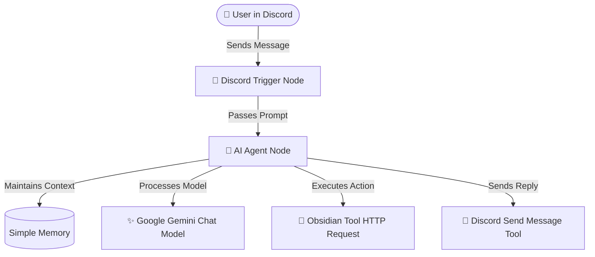

# 🤖 Discord ✖️ Obsidian AI Agent

  
  
  
  

A powerful, self-hosted automation workflow built inside **n8n** that links a **Discord Bot** to your **Obsidian Vault** using **Google Gemini** as an autonomous agent. Speak to your vault directly from your Discord server to read, write, append, or manage your second brain.

---

## ⚡ Key Features

*   **🧠 Fully Autonomous Agent:** Driven by LangChain inside n8n with dedicated tool utilization.
*   **📝 Live Note Management:** Seamlessly reads (`GET`), creates (`PUT`), appends (`POST`), or updates notes.
*   **💬 Contextual Memory:** Equipped with a windowed buffer memory to remember multi-turn conversations.
*   **🔒 Secure Locally:** Keeps all vault actions containerized on your private network space.

---

## 🛠️ System Architecture

---

## 💬Setup & Installation

### 1. Prerequisites
* A running instance of **n8n** (Docker setup recommended).
* **Obsidian** with the **Local REST API** plugin installed and enabled.
* A **Discord Bot Token** and target channel ID.
* A **Google Gemini API Key**.

### 2. Deploying the Template
1. Download the `workflow-template.json` file from this repository.
2. Open your n8n dashboard, click the top-right menu, and select **Import from file**.
3. Upload the JSON file to populate the canvas instantly.

### 3. Setting Up Credentials
* Configure the **Discord Trigger** and **Discord Tool** nodes with your Bot Token.
* Configure the **Gemini Chat Model** node with your Google API Key.
* Inside your `obsidian` tool node, set the URL to your local machine IP (`[http://192.168.29.67:27123](http://192.168.29.67:27123)`).

> ⚠️ **Security Note:** Never hardcode your Obsidian API Key inside the node header parameters directly if pushing to public repositories. Instead, declare it as a Docker environment variable and map it inside the node using `Bearer \{\{ \$env.OBSIDIAN_API_KEY \}\}`.

---

## 📄 License
MIT License. Free to use, modify, and build upon.
